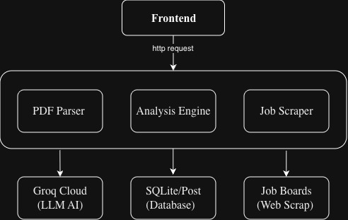

# Elevio Career API & Resume Analyzer

Elevio Career API is an intelligent career assistant built with FastAPI and integrated with Groq Cloud AI. It parses PDF resumes, matches them against job descriptions, computes precise ATS-style compatibility scores, and asynchronously scrapes relevant jobs based on candidate profiles.

## Demo Video
[](https://youtu.be/gE8D9nljh3o)

## Key Features
* PDF Resume Extraction: Efficient extraction of text from PDF resumes using PyMuPDF (fitz).
* AI-Powered Resume Analysis: Leverages LLMs via Groq API to extract missing skills, identify resume weak spots, suggest actionable rewrites, and forecast interview probability.
* Weighted Scoring Engine (ATS-Style): Implements a comprehensive scoring    algorithm breaking down profiles into:
    * Keyword Matching (40%)
    * Relevance Rating (30%)
    * Impact Score (20%)
    * Clarity & Readability (10%)
* Asynchronous Job Scraping & Ranking: Initiates threaded background tasks to scrape live jobs matching the candidate's optimal career trajectory and ranks them against their parsed profile.
* Rate Limiting & Security: In-built guardrails restricting heavy analytical operations (e.g., max 3 analyses per user per day; 15MB maximum file size uploads).


## Architecture & Tech Stack


### Tech Stack
* Backend Framework: FastAPI (Python 3.10+)
* AI Engine: Groq API (httpx async client)
* PDF Parsing: PyMuPDF (fitz)
* Task Management: Asyncio (Threaded execution for long-running scrapers)
* Containerization: Docker & Docker Compose
* Frontend: (Add your specific framework here if applicable, e.g., React / Next.js / Svelte)


## Environment setup
### Configure Environment Variables
```bash
cd backend
cp .env.example .env
# Edit .env and set qroq_api and postgres database
```

## 🐳 Quick Start with Docker (Recommended)
The fastest way to spin up both the frontend and backend environments is using Docker.


### Build and Run the Containers
Run the following command to build the images and launch the entire stack:
```bash
cd backend
docker compose up --build
```
start frontend in new terminal:
```bash
cd frontend
npm install # only for first run
npm run dev
```

To stop the backend, simply run:
```bash
docker compose down
```

## 🛠️ Local Development Setup (Without Docker)
If you prefer to run the backend natively for development or debugging:
### 1. Installation
Navigate into the backend directory, create a virtual environment, and install dependencies:
```bash
cd backend
python -m venv venv
source venv/bin/activate  # On Windows use: venv\Scripts\activate
pip install -r requirements.txt
```
In new terminal do backend set up:
```bash
cd backend
npm install
```
### 2. Run the Server
Start the Uvicorn development server for backend:
```bash
uvicorn main:app
```
Start the development server for frontend in new terminal:
```bash
npm run dev 
```


## 🔌 API Endpoints Reference
#### Core Operations
* POST /api/analyze - Uploads a PDF resume along with a text-based job description. Processes text extraction, runs Groq AI modeling, computes weighted matches, and responds with a profile deep-dive payload.
* POST /api/job_scrapping - Triggers a background thread to asynchronously hunt for matching roles in selected cities.
* GET /api/job_result/{job_id}/{resume_analysis_id} - Polls results from the scraper and ranks live vacancies dynamically using candidate resume metrics.
#### Configuration & Utilities
* GET /api/health - Check health status and monitor Groq API configuration visibility.
* GET /api/job_locations - Returns valid locations supported by the scraping agent.
* POST /api/upload_history & GET /api/history - Save and browse historical user profile analyses.
